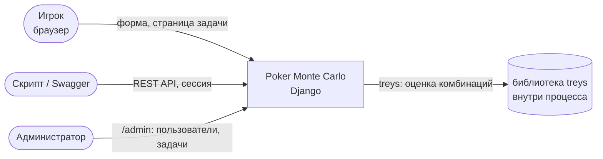
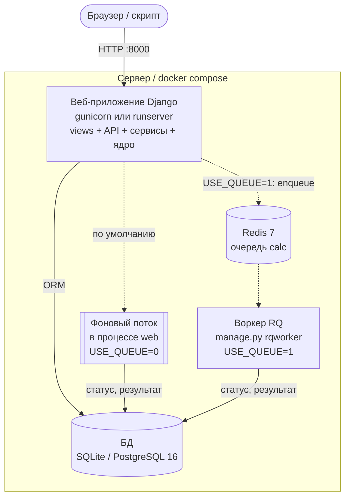
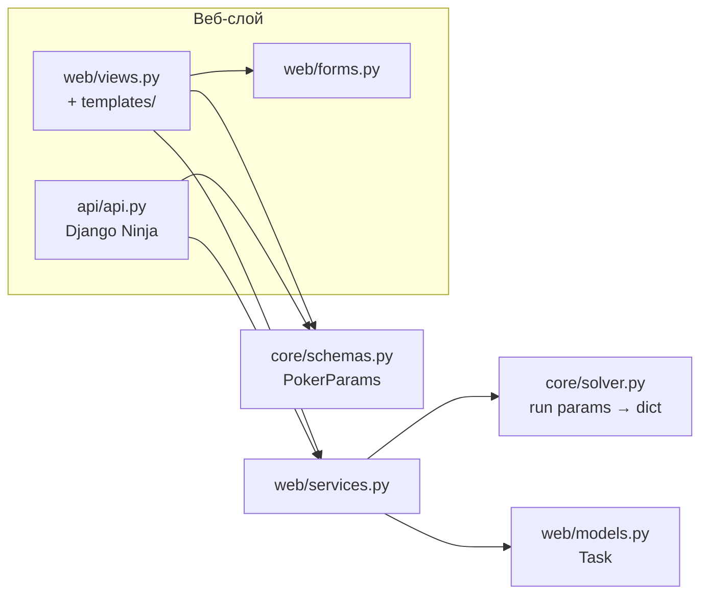
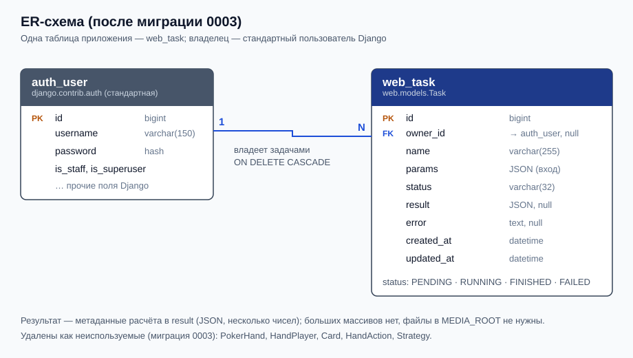
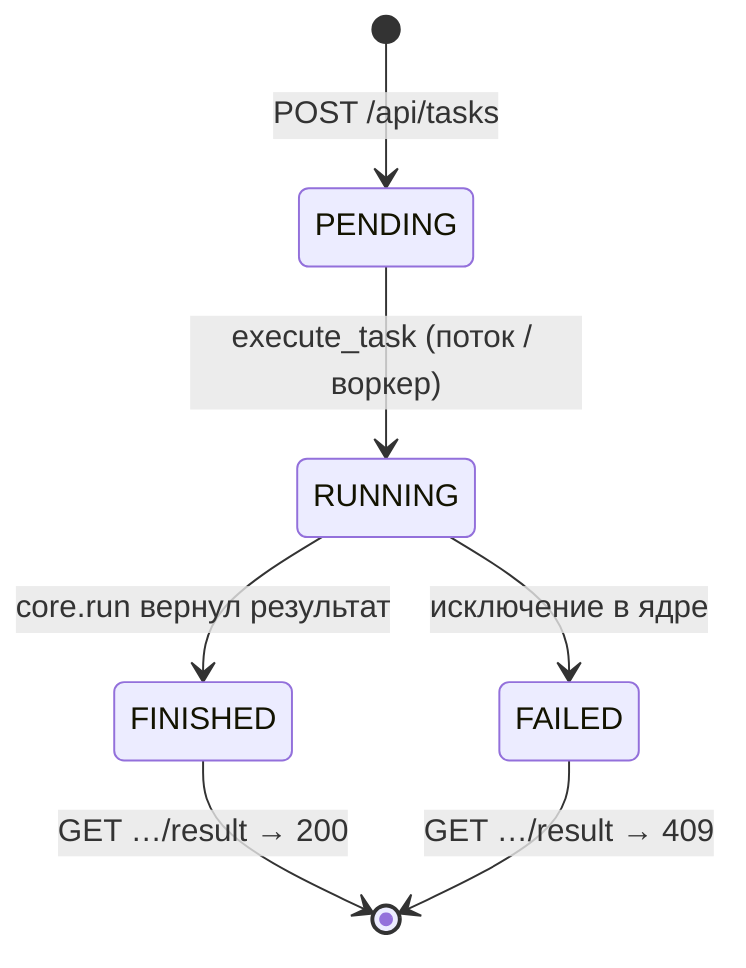
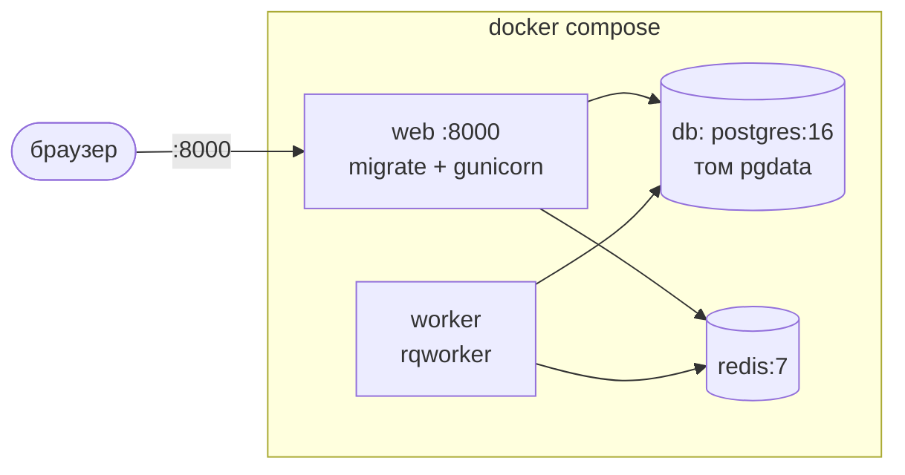

# Архитектура проекта Poker Monte Carlo

> Сервис поддержки решений в Texas Hold'em: оценка шансов руки методом Монте-Карло и рекомендация действия.
> Команда: Супаев Висхан, Харцаев Муслим, Асхабов Дени, Мустафаев Зелим. Версия от 2026-10-02.
> Диаграммы — Mermaid (рендерится на GitHub), ER-схема — [ER.svg](ER.svg).

## 1. Назначение и контекст
*Раздел подготовил: Супаев Висхан*

**Что делает.** Пользователь вводит состояние раздачи: 2 свои карты, 0–5 карт стола, число соперников,
число симуляций, банк и сумму колла. Сервис много раз случайно доигрывает раздачу, считает вероятности
победы/ничьей/поражения, эквити и даёт рекомендацию RAISE / CALL / CHECK / FOLD.

**Пример:** `As Ah`, 1 соперник, 10 000 симуляций → Win ≈ 0,85, рекомендация RAISE.

**Для кого.** Игроки, изучающие покер; учебный проект курса «Архитектура и проектирование веб-приложений».

**Границы.** Делаем: расчёт одной раздачи, хранение истории задач пользователя, веб-интерфейс и REST API.
Сознательно не делаем: игру за столом, диапазоны рук соперников, многопользовательские комнаты,
регистрацию (пользователей заводит администратор), оплату.

Внешних сетевых систем нет: сервис работает без интернета.

## 2. Требования и ограничения
*Раздел подготовил: Асхабов Дени*

**Ключевые требования**
- Расчёт до 200 000 симуляций × 9 соперников (≈ 22 с) не должен держать HTTP-запрос — ответ сразу, статус опросом.
- Плохой ввод отклоняется до расчёта (422), ни один ввод не даёт 500.
- Каждый пользователь видит только свои задачи.
- Воспроизводимость: `seed` фиксирует случайность, версии зависимостей закреплены.

**Ограничения:** команда из 4 студентов, сроки курса, стек зафиксирован ([ADR-001](adr/001-stack.md)):
Python 3.12+, Django 5.2, Django Ninja, pydantic, SQLite → PostgreSQL, Redis + RQ, pytest, Docker.

**Качественные атрибуты.** Главные: корректность расчёта (эталонные тесты), безопасность, простота
сопровождения (строгие слои). Принесены в жертву: производительность ядра (чистый Python, без NumPy/Numba)
и надёжность фонового расчёта (поток, а не очередь, по умолчанию — [ADR-002](adr/002-background-thread.md)).

**Риски:** перезапуск сервера теряет идущие расчёты; нет лимита частоты запросов;
режим очереди `USE_QUEUE=1` не проверен тестами (в `web/jobs.py` статус `QUEUED`, которого нет в модели).

## 3. Контейнеры (C4 уровень 2)
*Раздел подготовил: Мустафаев Зелим*

| Контейнер | Что выполняется | Взаимодействие |
|-----------|-----------------|----------------|
| web | HTTP, вход, валидация, создание задачи; по умолчанию — расчёт в фоновом потоке | ORM → БД |
| БД | `web_task`, `auth_user`, сессии | только через ORM |
| Redis + worker | расчёт задачи из очереди (режим заезда 2) | `enqueue("web.services.execute_task", id)` |
| Файловое хранилище | не используется: результат — несколько чисел в JSON | — |

## 4. Компоненты веб-приложения (C4 уровень 3, кратко)
*Раздел подготовил: Харцаев Муслим*

**Правило зависимостей** (AGENTS.md) и как оно соблюдено:
- `core/` не импортирует Django, не ходит в БД и HTTP — только `run(params) -> dict`; проверяется тем, что
  ядро тестируется без Django (`core/tests/`) и запускается как CLI `python -m core input.json`.
- Views и API не вызывают ядро напрямую и не меняют статусы — только `services.create_and_run`,
  `services.get_task`, `services.list_tasks`.
- Статусы меняются только в `services.execute_task` (и `jobs.enqueue_task` для очереди).
- Вход проверяется одной pydantic-схемой и для формы, и для API — до запуска расчёта.
- Антипример — `web/views_fat_example.py` (не подключён): разбор в [fat_review.md](fat_review.md).

## 5. Модель данных
*Раздел подготовил: Асхабов Дени*

| Сущность | Назначение | Ключевые поля |
|----------|------------|---------------|
| `auth_user` (Django) | пользователь, вход | `username`, `password` (хеш) |
| `web_task` | задача расчёта | `owner` → `auth_user` (1:N, `CASCADE`), `params` (JSON вход), `status`, `result` (JSON), `error` |

**Где хранится результат.** В `Task.result` (JSON): 6 чисел и строка рекомендации. Больших массивов нет,
поэтому `MEDIA_ROOT` не используется (правило «большое — в файлы» соблюдено тривиально).

**История схемы:** `0001` — начальная; `0002` — владелец задачи; `0003` — удалены неиспользуемые
`PokerHand`, `HandPlayer`, `Card`, `HandAction`, `Strategy` (их не использовал ни один код, кроме админки).

## 6. API
*Раздел подготовил: Асхабов Дени*

Полное описание — [docs/api.md](api.md), интерактивно — `/api/docs`.

| Ресурс | Метод | Запрос | Ответ | Коды |
|--------|-------|--------|-------|------|
| `/api/tasks` | POST | `{"name", "params"}` | `{"id", "status"}` | 202, 401, 403, 422 |
| `/api/tasks/{id}` | GET | — | `{"id", "status"}` | 200, 401, 404 |
| `/api/tasks/{id}/result` | GET | — | результат ядра | 200, 401, 404, 409 |

**Формат ошибок:** `{"detail": "текст"}`; для 422 — список `{"loc", "msg", "type"}` от pydantic.

## 7. Вычислительное ядро
*Раздел подготовил: Супаев Висхан*

**Контракт** `core.solver.run(params: dict) -> dict`, `VERSION = "1.0.0"`.
- Вход: `hole_cards`, `community`, `opponents`, `simulations`, `seed`, `pot_size`, `call_amount`
  (уже проверенные схемой `PokerParams`).
- Выход: `win_probability`, `tie_probability`, `loss_probability`, `equity`, `recommendation`, `simulations`.
- Ошибки: ядро не проверяет вход само — это делает схема; исключение ядра сервис превращает в `FAILED`.

**Метод.** Для каждой симуляции: перетасовать оставшиеся карты, дораздать стол и руки соперников,
оценить 7-карточные комбинации через `treys.Evaluator`, сравнить с лучшим соперником.
Эквити = Win + Tie/2. Рекомендация — сравнение эквити с pot odds `call / (pot + call)`:
выше на 15 п.п. → RAISE, выше → CALL, ниже → FOLD; `call_amount = 0` → CHECK (или CALL при эквити ≥ 0,5).

**Эталонные задачи** (`core/tests/test_solver.py`):
- каре тузов на столе → ровно 100 % ничьих (ответ известен точно);
- роял-флеш у героя против 9 соперников → ровно 100 % побед;
- AA против одного → 80–90 % побед (справочное значение ≈ 85 %);
- нет ставки и слабая рука → CHECK, а не FOLD.

**Ограничения:** ≤ 200 000 симуляций, ≤ 9 соперников; время ≈ 0,11 мс на симуляцию при 9 соперниках
(200 000 → ≈ 22 с, замеры в README). Память — константа (колода и счётчики).

## 8. Безопасность и доступ
*Раздел подготовили: Асхабов Дени, Харцаев Муслим*

Подробно — [security_review.md](security_review.md), решение — [ADR-003](adr/003-auth-owner.md).
- **Аутентификация:** сессия Django. Страницы — `@login_required` (→ `/accounts/login/`), API — 401 без входа.
- **Роли:** пользователь (свои задачи), администратор (`/admin`, все задачи и пользователи).
- **Изоляция:** все запросы к задачам — через сервисы с фильтром `owner`; чужая задача → 404.
- **Защищено фреймворком:** CSRF (формы и POST в API), хеширование паролей, экранирование в шаблонах,
  SQL-инъекции (ORM), `ALLOWED_HOSTS`.
- **Секреты:** только в `.env` (в git не попадает), шаблон — `.env.example`; без `SECRET_KEY` сервер не стартует.
  `DEBUG` выключен по умолчанию.
- **Проверенные угрозы:** доступ анонима, IDOR (чужие задачи), CSRF, огромный ввод (`name`, числа),
  невалидные карты, `eval` в «толстой» view (не подключена).

## 9. Развёртывание
*Раздел подготовил: Мустафаев Зелим*

**Переменные окружения** (`.env`, см. `.env.example`): `SECRET_KEY` (обязательно), `DEBUG`, `ALLOWED_HOSTS`,
`DATABASE_URL`, `USE_QUEUE`, `REDIS_URL`.

| Действие | Команды |
|----------|---------|
| Установка | `cp .env.example .env` → вписать `SECRET_KEY` → `docker compose up --build -d` → `docker compose exec web python manage.py createsuperuser` |
| Без Docker | `pip install -r requirements.txt` → `python manage.py migrate` → `createsuperuser` → `runserver` |
| Обновление | `git pull` → `docker compose up --build -d` (миграции применяются при старте `web`) |
| Откат | `git checkout <предыдущий тег>` → `python manage.py migrate web <номер миграции>` → `docker compose up --build -d` |

**Сеть без интернета:** заранее `pip download -r requirements.txt -d wheels/` и
`docker save postgres:16 redis:7 python:3.14-slim`; на месте — `pip install --no-index --find-links wheels/`
и `docker load`. Сам сервис внешних адресов не использует.

**CI:** GitHub Actions `.github/workflows/tests.yml` — на каждый push Python 3.12, `pip install`, `pytest -q`.

## 10. Эксплуатация
*Раздел подготовил: Мустафаев Зелим*

- **Логи:** стандартный вывод gunicorn/runserver (`docker compose logs web worker`); ошибка расчёта
  сохраняется в `Task.error` и видна на странице задачи.
- **Health-check:** отдельного эндпоинта нет; проверка — `GET /accounts/login/` → 200. (Кандидат на доработку.)
- **Бэкап:** SQLite — копия `db.sqlite3` при остановленном сервере; PostgreSQL —
  `docker compose exec db pg_dump -U calc calc > backup.sql`.

| Проблема | Причина | Действие |
|----------|---------|----------|
| Сервер не стартует: `SECRET_KEY не задан` | нет `.env` | `cp .env.example .env`, вписать ключ |
| Задача навсегда `RUNNING` | сервер перезапустили во время расчёта (ADR-002) | создать задачу заново |
| `DisallowedHost` / 400 | хост не в `ALLOWED_HOSTS` | добавить хост в `.env` |
| 403 `CSRF check Failed` в API | POST без заголовка `X-CSRFToken` | взять токен из cookie `csrftoken` |
| Нет стилей админки при `DEBUG=0` | статику отдаёт не Django | `collectstatic` + веб-сервер/WhiteNoise |

## 11. Решения (ADR)
*Раздел подготовил: Асхабов Дени*

| ADR | Решение |
|-----|---------|
| [ADR-001](adr/001-stack.md) | Стек: Django + Django Ninja, ядро отдельно от веб-слоя |
| [ADR-002](adr/002-background-thread.md) | Расчёт в фоновом потоке вместо синхронного в запросе; очередь RQ — под флагом `USE_QUEUE` |
| [ADR-003](adr/003-auth-owner.md) | Вход по сессии Django, владелец задачи, чужая задача — 404 |

Шаблон для новых — [adr/000-template.md](adr/000-template.md).

## 12. Ретроспектива и использование AI
*Раздел подготовила вся команда*

**Что бы сделали иначе**
- Сразу писать тесты, проверяющие результат, а не код ответа: тест «POST → 202» долго не замечал,
  что задача вообще не считается (вызывался `create_task` вместо `create_and_run`).
- Не заводить таблицы «на будущее»: пять моделей висели неиспользованными и были удалены миграцией `0003`.
- Владельца задачи и вход — с первого дня: добавлять их позже пришлось через все слои и все тесты.

**Как использовали AI-ассистенты.** Claude Code — для рефакторинга, тестов и документации по заданиям
занятий; каждое изменение — с тестом и отдельным коммитом, правила проекта — в `AGENTS.md`.

**Где AI ошибался или требовал проверки, и как ловили**
- Тесты с фоновым потоком падали примерно в 1 из 10 запусков (SQLite в памяти не ждёт блокировку) —
  поймали многократным прогоном (40 подряд), исправили файловой тестовой БД.
- Задание просило `gt=0` для `call_amount` — это сломало бы CHECK при нулевой ставке; оставили `ge=0`.
- Стандартный `django_auth` отдавал анониму 403 (CSRF) вместо 401 — заметили только при проверке живого
  сервера curl'ом, тестовый клиент CSRF пропускает.
- Патч применяли повторно поверх уже применённого — `git apply` падал; вывод: проверять `git log`
  и пользоваться `git apply --check`.
- Правило: не принимать код без запуска `pytest -q` и `ruff check .` и без проверки на живом сервере.
